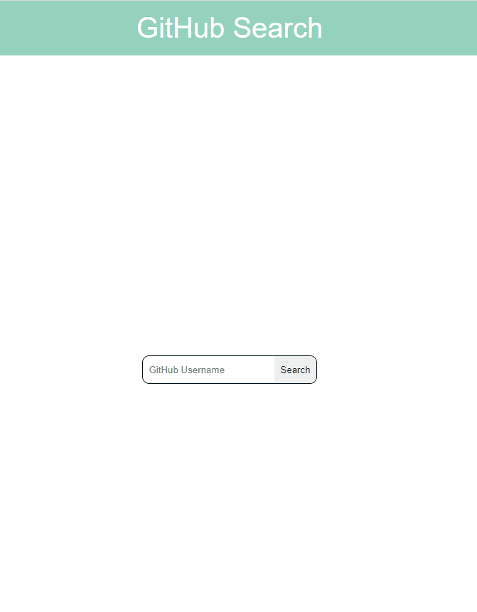

<h1 align="center">
GitHub Search</h1>

# About the project
A litle project made with Javascript/React/SnowPack

## Available Scripts
In the project directory, you can run:

## npm start
Runs the app in the development mode.
Open http://localhost:8080 to view it in the browser.

## npm run test Search
Run the above command to display the Jest test example
See the section about running tests (https://jestjs.io/pt-BR/docs/getting-started) for more information.

  

   

## 🚀 Technologies 

- [Javascript](https://www.javascript.com/)
- [SnowPack](https://www.snowpack.dev/)
- [CSS](https://developer.mozilla.org/en-US/docs/Web/CSS)
- [HTML](https://developer.mozilla.org/pt-BR/docs/Web/HTML)
- [Styled-Components](https://styled-components.com/)
- [Jest](https://jestjs.io/pt-BR/docs/getting-started)

 Made with ♥ by Victor Gonzalez 😉 [See my linkedin] (https://www.linkedin.com/in/victor-gonzalez-4550a0176/)